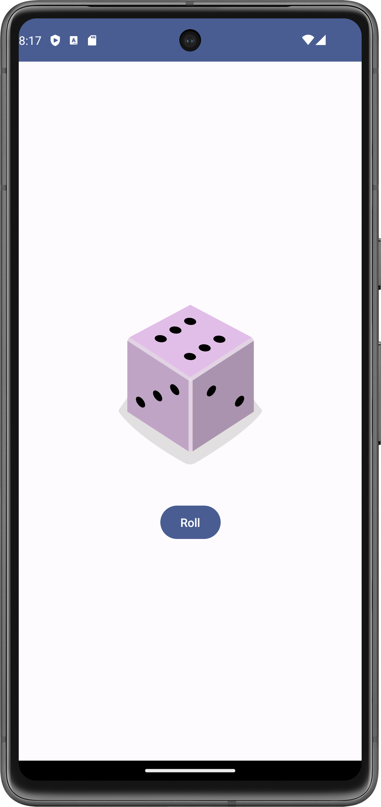

# Dice Roller App 🎲

A simple **Dice Roller** app built using **Kotlin** and **Jetpack Compose**. The app allows users to roll a 6-sided dice, dynamically updating the UI with the dice result.

## Features
- Roll a 6-sided dice by pressing a button.
- Dynamically updates the dice image based on the result.
- Built using **Jetpack Compose** for a modern, declarative UI.
- Utilizes **State Management** with `remember` and `mutableStateOf`.
  
## Getting Started

1. Open the project in **Android Studio**.
2. Build and run the project on an emulator or physical device.

## How It Works
- The dice result is stored using `remember` and `mutableStateOf`.
- The dice image updates based on the rolled value using **Image** and **painterResource**.
- A **Button** triggers the dice roll by generating a random number from 1 to 6.

### Code Snippet: Dice Roll Logic
```kotlin
Button(onClick = { result = (1..6).random() }) {
    Text(text = stringResource(id = R.string.roll))
}
```

## Screenshots
<div align="center">
<!-- Main Screen -->

<p style="text-align:center;"><em>Main screen interface.</em></p>

</div>


## Tools & Technologies
- __Kotlin__
- __Jetpack Compose__
- __Android Studio__
- __State Management (remember and mutableStateOf)__
## Debugging Features
- Set breakpoints.
- Step into, over, and out of code execution.
- Inspect variables while debugging.

